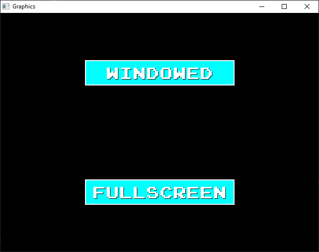
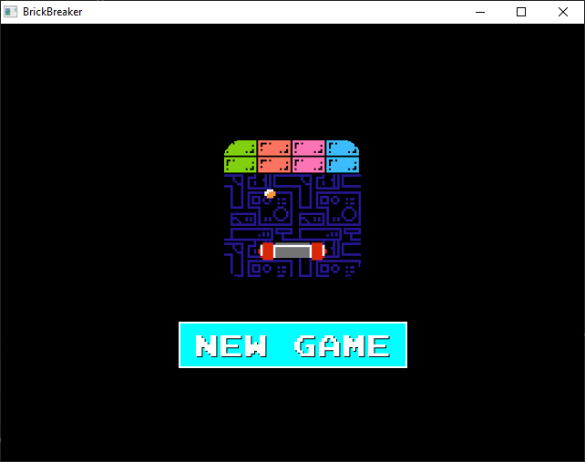
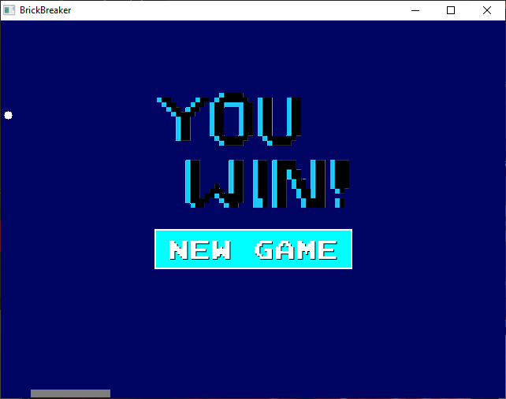
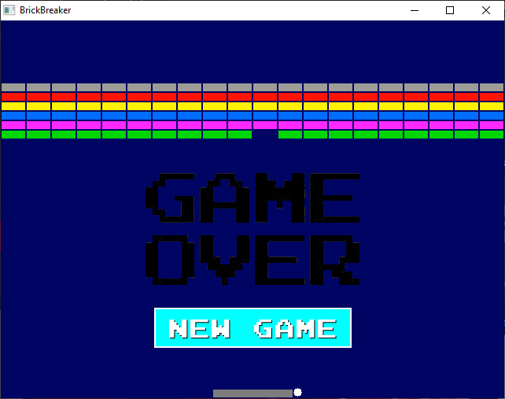
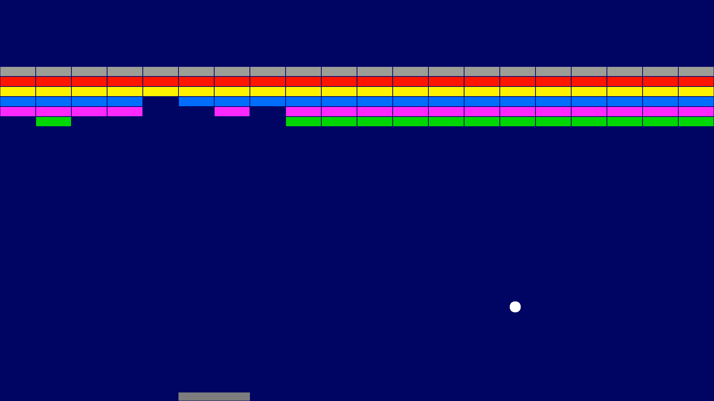

# Arcanoid
This game is an implementation of the old-school Arcanoid.
The game is written in C++ with the help of SDL2 and a wrapper layer above that. To make it work you should install SDL2.

# Easter egg
You can press *u* button to make the ball super (breaks every brick if collision). You can adjust the resolution in *main.cpp* by setting *XX* and *YY* constants.

# Some pictures from the game
- At the beginning you can choose from *Windowed* and *Fullscreen* options:

- Then you can start a new game:

- If you win:

- If you loose:

- Fullscreen:

